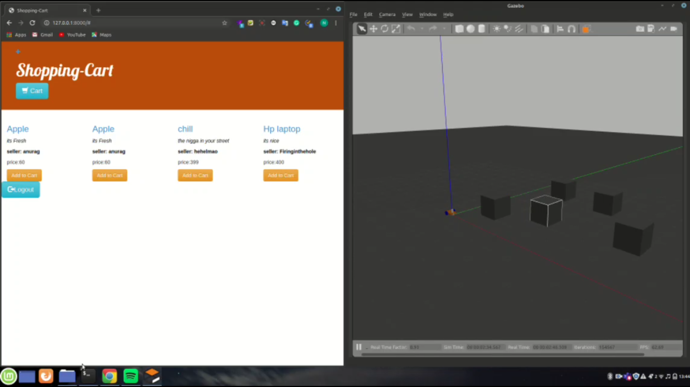

# Autonoums-navigatation
This is a ROS packackge built for autonoums navigatation thorugh website it actually facilitates a autonoums delivery system when its run along 
with <a href="https://github.com/X-Gen1913/Shopping-Cart">Shopping-Cart</a>.The simulatation file is setup in <a href="https://github.com/Blackcipher101/Autonoums_robot_simulatation">Simulaltation</a>

## Thought Process
One day I saw my mom complaining about how the delivery of the essential goods during the pandemic was so delayed and still unsafe. I thought hard and how about we put robots in place of humans and interface it with a website. So I tried learning technologies to solve the issue and build something that solves it.

## Demo

https://user-images.githubusercontent.com/33775493/122667903-fd6c4280-d1d2-11eb-859a-ac09973f2fdf.mp4


## Hurdles
I was starting from scratch as I had no experience in ROS so I started with the documentation learnt a bit. Then I nose-dived into the project and understood by failing most of the times.


And the other thing was when I built it was taking a longer path so I optimized it using the A* algorithm that is attaching a heuristic function to it 
reference: <a href="https://www.sciencepubco.com/index.php/ijet/article/download/10067/3572">paper</a>
##### Before optimiztation

https://user-images.githubusercontent.com/33775493/122667882-e3326480-d1d2-11eb-9e35-81d18961b292.mp4


## Tech-Stack

<p>Its built using the technoliges below</p>
<ul>
<li>ROS</li>
<li>Gazebo</li>
<li>Web-sockets</li>
<li>Open-CV</li>
</ul>

### ROS
<p>The Robot Operating System (ROS) is a flexible framework for writing robot software. It is a collection of tools, libraries, and conventions 
that aim to simplify the task of creating complex and robust robot behavior across a wide variety of robotic platforms.</p>

### Gazebo
<p>Robot simulation is an essential tool in every roboticist's toolbox. A well-designed simulator makes it possible to rapidly test 
algorithms, design robots, perform regression testing, and train AI system using realistic scenarios.</p>

##### Simultation in gazebo and rviz

https://user-images.githubusercontent.com/33775493/122667933-242a7900-d1d3-11eb-90fd-90d7b089eff9.mp4


### Web-Sockets
<p>A WebSocket is a standard protocol for two-way data transfer between a client and server. The WebSockets protocol does not run 
over HTTP, instead it is a separate implementation on top of TCP.</p>


### Open-CV
<p>OpenCV (Open Source Computer Vision Library) is an open source computer vision and machine learning software library. OpenCV was built
to provide a common infrastructure for computer vision applications and to accelerate the use of machine perception in the commercial 
products.</p>

### Funtionalaties
<ul>
<li>Obstacle avoidance</li>
<li>Path planning</li>
<li>Works with the website</li>
</ul>

#### Introduction 
To setup this project first setup a ROS package(<a href="http://wiki.ros.org/ROS/Tutorials/BuildingPackages">tutrioal</a>)
Then clone the repo in the /src folder and build excutables using 
```
catkin_make
```
Get the <a href="">simulaltation</a> up and running

Now run it

Also start the <a href="https://github.com/Blackcipher101/Shopping-Cart">Shopping-Cart</a> 
Now when You go to the cart enter the cordinates in the format 
```
x:your_x_coordinate y:your_y_coordinate
```
Voila!!! Your robot moves to the specified postions navigating the obsatcles and planning the optimal path

# ScreenShots
#### Website



#### Entering co-ordinates


#### Start-of-robot


#### Navigatating obstacles


#### Reaching destination


